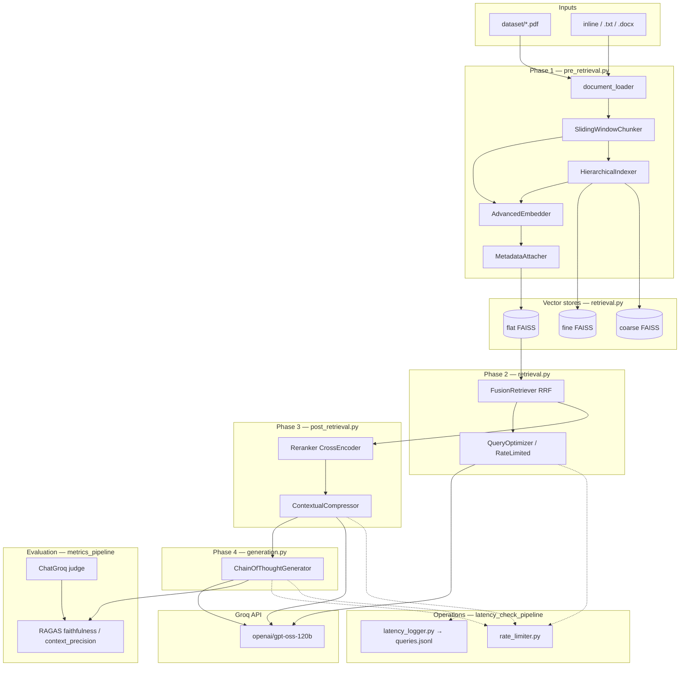
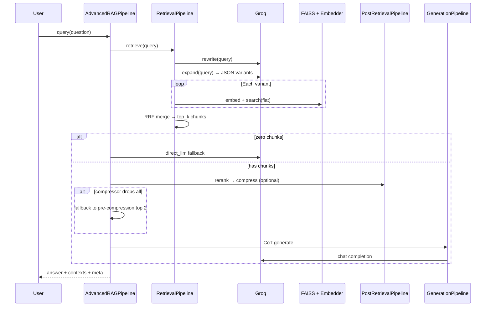

# Production RAG — Advanced Retrieval-Augmented Generation

A modular, production-style RAG system that ingests long documents (PDF/DOCX/text), indexes them with dense embeddings and optional hierarchical chunks, retrieves with LLM query optimization and reciprocal-rank fusion, refines context with cross-encoder reranking and optional LLM compression, and answers with chain-of-thought prompting on **Groq** (`openai/gpt-oss-120b`). The project includes **RAGAS** offline evaluation and an optional **latency + rate-limit** pipeline for observability.

**Author:** Krishna Khandelwal 

---

## Table of contents

1. [What this project does](#what-this-project-does)
2. [Repository layout — every file explained](#repository-layout--every-file-explained)
3. [System architecture](#system-architecture)
4. [End-to-end execution flow](#end-to-end-execution-flow)
5. [Four pipeline phases (features)](#four-pipeline-phases-features)
6. [Entry points — which script to run](#entry-points--which-script-to-run)
7. [Evaluation results (RAGAS)](#evaluation-results-ragas)
8. [Latency & operations (observed runs)](#latency--operations-observed-runs)
9. [Setup & configuration](#setup--configuration)
10. [Design qualities](#design-qualities)
11. [Known limitations](#known-limitations)

---

## What this project does

| Stage | Technology | Purpose |
|-------|------------|---------|
| **Ingest** | PyMuPDF / python-docx | Extract text from PDFs and documents |
| **Index** | NLTK chunking, SentenceTransformers, FAISS | Sentence-aware chunks, 384-d embeddings, vector search |
| **Retrieve** | Groq LLM + FAISS | Query rewrite, multi-query expansion, RRF fusion |
| **Refine** | Cross-encoder + Groq | Rerank passages; optionally compress to relevant sentences |
| **Generate** | Groq CoT prompt | Step-by-step grounded answers |
| **Evaluate** | RAGAS + Groq judge | Faithfulness and context precision vs. ground truth |
| **Observe** (optional) | Token bucket + JSONL logs | Reduce 429s; record per-phase latency |

Demo corpus: *AI Engineering* by Chip Huyen (~1.1M characters, 1108 PDF pages when fully ingested).

---

## Repository layout — every file explained

```
Production_Rag/
│
├── pipeline.py                    # Root orchestrator + RAGAS demo (same logic as metrics_pipeline)
├── requirements.txt               # Python dependencies
├── .env                           # GROQ_API_KEY (local only — do not commit secrets)
├── README.md                      # This document
├── _strip_comments.py             # Utility: removes # comments and docstrings from .py files
│
├── dataset/                       # Source documents (e.g. PDF books)
│   └── AI Engineering_ ...pdf   # Default eval corpus for metrics_pipeline
│
├── logs/                          # Runtime logs (latency pipeline)
│   └── queries.jsonl            # One JSON object per query (timing, chunks, tokens)
│
├── pipelines/                     # Runnable pipeline variants
│   ├── __init__.py                # Marks pipelines as a package (optional)
│   ├── _bootstrap.py              # Shared PROJECT_ROOT helper (path setup)
│   ├── metrics_pipeline.py        # Full RAG + RAGAS on PDF; fixes import path for `components`
│   └── latency_check_pipeline.py  # RAG + GroqRateLimiter + LatencyLogger; inline demo text
│
└── components/                    # Core library modules (imported by all pipelines)
    ├── document_loader.py       # load_document / load_documents — PDF, DOCX, TXT, MD
    ├── pre_retrieval.py         # Phase 1: chunking, embeddings, hierarchy, metadata
    ├── retrieval.py             # Phase 2: FAISS store, query optimizer, fusion RRF
    ├── post_retrieval.py        # Phase 3: cross-encoder rerank, contextual compression
    ├── generation.py            # Phase 4: chain-of-thought answer generation
    ├── rate_limiter.py          # Token-bucket throttling for Groq TPM/RPM limits
    └── latency_logger.py        # Per-query timing, tokens, chunk counts → JSONL + console
```

### File-by-file reference

| File | Role |
|------|------|
| **`pipeline.py`** | Defines `AdvancedRAGPipeline` and a `__main__` block: ingest, query demo, RAGAS evaluation. Run from project root: `python pipeline.py`. |
| **`pipelines/metrics_pipeline.py`** | Same RAG class + RAGAS eval as `pipeline.py`, but adds `_PROJECT_ROOT` to `sys.path` so it works when run as `python pipelines/metrics_pipeline.py`. Uses PDF under `dataset/` and two Chip Huyen–style eval questions. |
| **`pipelines/latency_check_pipeline.py`** | Extended orchestrator: `GroqRateLimiter`, `RateLimitedQueryOptimizer`, `RateLimitedCompressor`, `LatencyLogger`. Demo uses short inline `_DEMO_TEXT` (fast ingest). Returns `latency`, `tokens`, `rate_limit_wait` per query. |
| **`pipelines/_bootstrap.py`** | Exposes `PROJECT_ROOT` and `ensure_project_root_on_path()` for consistent imports from subfolders. |
| **`pipelines/__init__.py`** | Empty package marker. |
| **`components/document_loader.py`** | `_extract_pdf` (PyMuPDF), `_extract_docx`, `_extract_txt`; returns `{text, source}`. |
| **`components/pre_retrieval.py`** | `Chunk`, `SlidingWindowChunker`, `AdvancedEmbedder` (MiniLM-L6-v2), `HierarchicalIndexer`, `MetadataAttacher`, `PreRetrievalPipeline`. |
| **`components/retrieval.py`** | `VectorStore` (FAISS IndexFlatIP), `QueryOptimizer`, `FusionRetriever`, `RetrievalPipeline`. |
| **`components/post_retrieval.py`** | `Reranker` (ms-marco cross-encoder), `ContextualCompressor`, `PostRetrievalPipeline`. |
| **`components/generation.py`** | `ChainOfThoughtGenerator`, `GenerationPipeline`. |
| **`components/rate_limiter.py`** | `TokenBucket`, `GroqRateLimiter` — estimates token cost per call type and sleeps when bucket is low. |
| **`components/latency_logger.py`** | `QueryLog`, `LatencyLogger`, `load_logs()` — JSONL persistence and console summary bars. |
| **`_strip_comments.py`** | Dev utility: strip comments/docstrings from all `.py` files (skips `README.md`). |
| **`logs/queries.jsonl`** | Append-only audit trail from latency pipeline (not hand-edited). |
| **`requirements.txt`** | `groq`, `sentence-transformers`, `faiss-cpu`, `nltk`, `ragas`, `langchain-groq`, etc. |
| **`.env`** | Stores `GROQ_API_KEY` for Groq API access. |

---

## System architecture

### Component graph



> **Retrieval note:** `FusionRetriever` searches the **flat** index today. Fine and coarse stores are built during ingest for hierarchical structure and future multi-granularity retrieval.

### Query-time sequence



---

## End-to-end execution flow

### A. Ingestion (offline, once per document)

```
document_loader  →  raw text
       ↓
PreRetrievalPipeline.run()
  • flat chunks (5 sentences, overlap 1)
  • optional fine (2) + coarse (6) hierarchical chunks
  • embed all with all-MiniLM-L6-v2 (384-d, normalized)
  • attach keywords, entities, language
       ↓
VectorStore.add_chunks()  →  flat + fine + coarse FAISS indexes
       ↓
_build()  →  wire RetrievalPipeline, PostRetrievalPipeline, GenerationPipeline
```

**Observed ingest** (full *AI Engineering* PDF):

| Index | Chunk count |
|-------|-------------|
| flat | 2,413 |
| fine | 4,783 |
| coarse | 1,930 |
| PDF | 1,108 pages, ~1,092,403 characters |

### B. Query (online, per question)

```
1. QueryOptimizer.rewrite(query)           [Groq]
2. QueryOptimizer.expand(query) → variants [Groq]
3. For each variant: embed → FAISS search  [local]
4. Reciprocal Rank Fusion → top_k=8      [local]
5. CrossEncoder rerank → top 3           [local]
6. ContextualCompressor per chunk        [Groq, optional]
7. Chain-of-Thought generation           [Groq]
8. (metrics_pipeline only) log contexts for RAGAS
```

---

## Four pipeline phases (features)

### Phase 1 — `pre_retrieval.py`

- Sentence-boundary chunking (NLTK), heading hints from `#` or ALL-CAPS lines.
- **`Chunk`**: `chunk_id`, `content`, `embedding`, rich `metadata`.
- **HierarchicalIndexer**: parent/child links between fine and coarse windows.
- **MetadataAttacher**: language guess, top keywords, simple entity regex.

### Phase 2 — `retrieval.py`

- **FAISS** `IndexFlatIP` on L2-normalized embeddings (cosine similarity).
- **Query rewrite** + **3 paraphrase variants** (JSON) per query.
- **RRF** (`rrf_k=60`) merges ranked lists from all variants.

### Phase 3 — `post_retrieval.py`

- **Reranker**: `cross-encoder/ms-marco-MiniLM-L-6-v2`, score threshold, `top_k=3`.
- **Compressor**: extracts verbatim relevant sentences or marks `IRRELEVANT` (chunk dropped).

### Phase 4 — `generation.py`

- Numbered context blocks (word budget ~1800).
- Explicit CoT: cite passages → reason → final answer grounded in context only.

---

## Entry points — which script to run

| Command | Use when |
|---------|----------|
| `python pipeline.py` | Run from **project root**; RAG + RAGAS on configured PDF path. |
| `python pipelines/metrics_pipeline.py` | Same as above; **recommended** if you work from `pipelines/` folder (auto `sys.path` fix). |
| `python pipelines/latency_check_pipeline.py` | Benchmark latency, rate limiting, JSONL logs; small inline corpus. |

**Programmatic use:**

```python
from pipeline import AdvancedRAGPipeline

rag = AdvancedRAGPipeline(use_compression=True, use_hierarchical=True)
rag.ingest("dataset/your_file.pdf")
result = rag.query("Your question?")
print(result["answer"])
print(result["raw_context_strings"])
```

---

## Evaluation results (RAGAS)

Evaluated with:

- **Judge LLM:** `ChatGroq` → `openai/gpt-oss-120b` via `LangchainLLMWrapper`
- **Embeddings:** `HuggingFaceEmbeddings` → `sentence-transformers/all-MiniLM-L6-v2`
- **Metrics:** `faithfulness`, `context_precision`
- **Corpus:** *AI Engineering* PDF (full ingest)
- **Questions:** 2 demo items in `metrics_pipeline.py` (see script for exact wording)

### Run A — earlier eval set (2 questions)

| Metric | Aggregate |
|--------|-----------|
| **Faithfulness** | **0.8125** |
| **Context precision** | **0.2500** |

| Row | Faithfulness | Context precision |
|-----|--------------|-------------------|
| Q0 | 0.750 | 0.000 |
| Q1 | 0.875 | 0.500 |

### Run B — updated questions (context retrieval + AI-as-Judge biases)

| Metric | Aggregate |
|--------|-----------|
| **Faithfulness** | **0.9706** |
| **Context precision** | **0.1667** |

| Row | Question (summary) | Faithfulness | Context precision | Notes |
|-----|-------------------|--------------|-------------------|--------|
| Q0 | Idea behind context retrieval | **1.000** | **0.333** | Strong grounded answer; retrieval found relevant augmented-chunk passages |
| Q1 | Four cognitive biases (AI-as-Judge) | **0.941** | **0.000** | Model honestly said context lacked biases; compressor dropped **all** chunks → fallback to pre-compression context → **low context precision** |

**How to read these scores**

| Metric | Meaning (0–1, higher is better) |
|--------|----------------------------------|
| **Faithfulness** | Are answer claims supported by retrieved contexts? High scores mean the model stayed grounded (including “not in context” answers). |
| **Context precision** | How precise were retrieved contexts vs. ground-truth signal? Low Q1 score reflects **retrieval/compression failure**, not necessarily a hallucinated answer. |

**Takeaway:** Faithfulness is strong when the pipeline retrieves the right passages (Q0). Context precision stays challenging on needle-in-haystack questions across a 1M+ character book unless retrieval hits the exact section (Q1).

---

## Latency & operations (observed runs)

From `latency_check_pipeline.py` (inline demo text, rate limiter enabled, logs in `logs/queries.jsonl`):

### Per-query totals (4-query session)

| query_id (short) | Total latency (s) | Chunks used in LLM | Rate-limit wait (s) |
|------------------|-------------------|--------------------|---------------------|
| db911486 | 5.003 | 2 | 0.0 |
| 58aa2d52 | 2.596 | 1 | 0.0 |
| 483eb5ba | 8.979 | 2 | 0.0 |
| 01ce63ea | **13.838** | 1 | 0.0 |

### Example breakdown — “three stages of the core RAG pipeline”

| Phase | Time (s) | Activity |
|-------|----------|----------|
| Phase 2 — Retrieval | 4.64 | rewrite + expand + 4× FAISS search + RRF |
| Phase 3 — Post-retrieval | 4.15 | rerank + 1× compression (Groq) |
| Phase 4 — Generation | 5.05 | CoT answer (Groq) |
| **Total** | **13.84** | End-to-end |

**Chunk funnel (same query):** `2 retrieved → 1 after rerank → 1 after compress → 1 sent to LLM`

**Groq 429 behavior:** Logs show `HTTP/1.1 429 Too Many Requests` on compression/generation with automatic retries (3–4 s backoff) before `200 OK` — the Groq SDK retry path, complemented in the latency pipeline by `GroqRateLimiter`.

**Token logging note:** Console summary showed `tokens_* = 0` in some log rows; CoT still reported usage (e.g. 455 tokens) in generation. Token fields in `QueryLog` may need wiring from API `usage` in a future pass.

---

## Setup & configuration

### 1. Install dependencies

```bash
cd "D:\ML Projects\Production_Rag"
pip install -r requirements.txt
```

Add if using RAGAS embeddings as in metrics pipeline:

```bash
pip install langchain-community python-dotenv
```

### 2. Environment

Create `.env` at project root:

```env
GROQ_API_KEY=your_groq_key_here
```

Get a key at [https://console.groq.com](https://console.groq.com).

### 3. Run metrics evaluation (full PDF — long first run)

```bash
python pipelines/metrics_pipeline.py
```

Expect several minutes for first-time embedding of ~2.4k+ flat chunks and hierarchical indexes.

### 4. Run latency demo (fast)

```bash
python pipelines/latency_check_pipeline.py
```

---

## Design qualities

| Quality | Implementation |
|---------|----------------|
| **Modularity** | Four phase modules + thin orchestrators |
| **Grounding** | CoT template + faithfulness-oriented eval |
| **Recall** | Multi-query expansion + RRF |
| **Precision** | Cross-encoder rerank + optional compression |
| **Cost control** | Local embeddings/reranker; Groq only for LLM steps |
| **Resilience** | Direct LLM fallback; pre-compression chunk fallback |
| **Observability** | Phase banners, metadata dicts, optional JSONL latency logs |
| **Rate safety** | Token bucket in latency pipeline |

### Models & services

| Component | Model / library |
|-----------|-----------------|
| Embeddings | `sentence-transformers/all-MiniLM-L6-v2` (384-d) |
| Vector index | FAISS `IndexFlatIP` |
| Reranker | `cross-encoder/ms-marco-MiniLM-L-6-v2` |
| LLM (all Groq calls) | `openai/gpt-oss-120b` |
| RAGAS judge | `openai/gpt-oss-120b` via `ChatGroq` |

---

## Quick reference — data returned by `query()`

```python
{
  "answer": str,
  "strategy": "chain_of_thought" | "direct_llm_fallback",
  "chunks_used": int,
  "retrieval_meta": dict,
  "post_meta": dict,
  "raw_context_strings": list[str],   # for RAGAS / debugging
  # latency_check_pipeline also adds:
  "latency": {"phase2_secs", "phase3_secs", "phase4_secs", "total_secs"},
  "tokens": {"query_rewrite", "compression", "generation", "total"},
  "rate_limit_wait": float,
}
```

---
